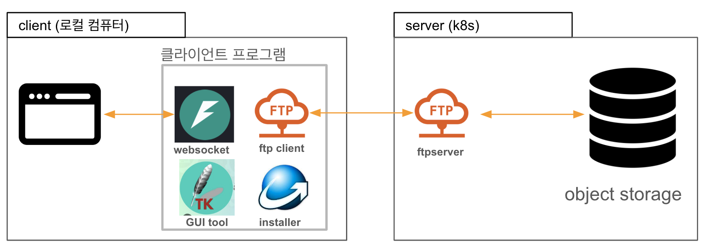
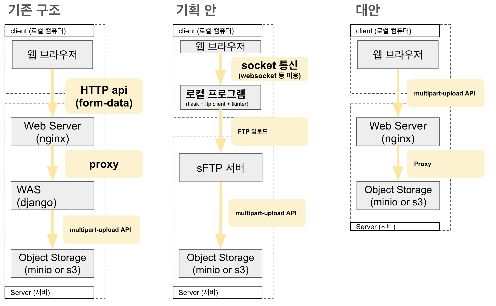

# [ 기술 검토 : sFTP 클라이언트를 통한 대용량 웹 업로드 기능 개발 ]

## 목적

유저가 **웹 브라우저**를 통해 대용량 파일을 인프라 내 **Object Storage**로 업로드하는 환경을 개선하고 싶다.

1. 구현가능성 검토
> 업로드/다운로드용 web Client 프로그램 구현 가능성 검토

2. 기술타당성 검토
> 제안한 기획안이 기존의 업로드 방식과 비교하여 성능 및 안정성 검토

## (1) 구현 가능성 검토 

### 1. 컴포넌트 설명

#### 1.1. 클라이언트 프로그램에 필요한 스택

* `websocket server` : Broswer로부터 업로드할 파일을 받아오는 서버 (ex : fastAPI)
    * 브라우저에서는 파일 이름 / 파일 내용만 제공할 뿐, 보안상 이유로 파일 경로를 제공하지 않음.
    * 클라이언트 프로그램에서 파일을 보내기 위해서는 업로드할 파일을 우선 temporary file로 저장해야 함.

* `gui tool` : 설치할 프로그램에 대한 클라이언트 화면
    * python에서는 tkinter / pyQT5 등이 있는데, 오픈소스 tkinter을 이용가능

* `ftp client` : 받은 파일을 server로 업로드하는 클라이언트 로직

* `installer 프로그램` : 파이썬이 안 깔려잇는환경에서도 설치할 수 있도록 설치 화면 관리자를 만들어주는 프로그램
    * innosetup 등이 있는데, innosetup의 경우 파스칼 언어로 작성 필요 

#### 1.2. 서버 프로그램에 필요한 스택

* ftp server : 클라이언트 프로그램이 업로드한 파일을 받아서 object storage로 업로드하는 서버
    * object storage에서는 ftp 프로토콜을 지원하지 않기 때문에 중개해주는 서버 필요

### 2. 업로드 과정 설명

1. Web Browser에서 올리고 싶은 데이터를 선택(유저)

2. Web Broswer에서 선택한 데이터를 클라이언트 프로그램 내 websocket server로 전송
    * 이유 : `브라우저에서는 파일 이름 / 파일 내용만 제공할 뿐, 보안상 이유로 파일 경로를 제공하지 않음`

3. websocket server는 받은 데이터를 temporary file로 저장
   * 이유 : 브라우저가 멈추더라도 비동기적으로 파일을 보낼 수 있게 하기 위해선 우선 저장 필요

4. 클라이언트 프로그램은 ftp client를 통해 temporary file을 ftp server로 전송
    * 이유 : `object storage에서는 ftp 프로토콜을 지원하지 않기 때문에 중개해주는 서버 필요`

5. ftp server는 받은 파일을 object storage로 업로드

##  (2) 기술 타당성 검토

### (1) 기존안 : `django-storages`를 활용한 업로드

현재 서비스에서는 `django-storages`를 활용하여 구현되어 있습니다. 
웹 브라우저에서 파일을 올리면, 우선 장고서버에서 해당 파일을 temporary file로 저장 후,
Object Storage로 upload 하는 방식으로 구현되어 있습니다.

#### 잠재 문제점
1. 파일을 먼저 WAS에 저장해야 하기 때문에, 대용량 파일을 업로드할 때에는 WAS의 디스크 용량이 부족할 수 있습니다.
2. 파일 업로드가 중간에 끊기거나, 브라우저를 내리면, 업로드가 중단됩니다.
3. WAS 서버의 부하가 높아질 수 있습니다.

### (2) 기획안: FTP 서버를 통한 업로드

#### 한계점

1. object storage에서는 ftp를 직접 지원하지 않기 때문에, ftp 서버가 필요하고, 이 때 동시 접속 수 만큼의 port를 오픈해야 합니다.
2. FTP 서버를 통한 업로드는 업로드 다운로드 속도가 더 빠르지 않습니다 (성능 비교 실험 참고)
    * 기존 안과 비슷하거나, 더 느림
3. 클라이언트 환경에도 추가적인 디스크 공간이 필요하며, 대용량 파일 업로드 시 로컬 디스크 용량이 부족할 수 있습니다.

### (3) 대안 : object storage로 직접 업로드

object storage에서는 presigned-url을 이용해서 WAS를 경유하지 않고 직접 object storage에 업로드할 수 있습니다.

## 성능비교
* HTTP과 ftp의 업로드 환경을 서버 구축 후, 업로드 속도 비교
  * 기존 안 : `django_uploader/` : django-storages를 통한 장고 서버 구축 
  * 기획 안 : `ftp_uploader/` : ftp 서버 구축
  * 대안 : `boto3.upload_file` <- 내부적으로 multipart upload 지원

실험 참고
1. 웹서버(nginx)를 경유하지 않도록 설계( nginx에서 자체 캐싱 로직이 있어서 정확한 비교 어려움 )
2. 구현 편의를 위해, secure protocol은 쓰지 않고 구현하였음 (secure protocol에 의한 속도 저하는 다 유사하다고 판단)

#### 실험결과

* 기획안이 가장 느림 
    * 프로토콜 스펙 상 ftp는 http보다 속도가 빠르지 않음.

| 파일크기 | 기존안 | 기획안 | 대안 |
| ---    | ---  | ---  | --- |
| 10MB   | 1.16 s ± 7.89 ms | 1.18 s ± 7.8 ms | **1.01 s ± 6.33 ms** |
| 64MB | 7.29 s ± 441 ms | 7.08 s ± 94.1 ms|  **6.03 s ± 121 ms** |
| 128MB  | 14.4 s ± 312 ms | 17.1 s ± 234 ms | **11.8 s ± 63.8 ms** |

## 제기된 이슈들

### 1. 인프라 독립성 : multipart upload로 구현할 경우, AWS S3에만 국한되어 활용가능하지 않은가? 

=> S3 API 규격은 다른 오픈소스 프로젝트 & 국내 클라우드에서도 차용해, 범용적으로 활용 가능

많은 Object Storage는 Multipart Upload와 유사한 스펙을 제공하고 있습니다.
국내 클라우드 업체의 경우에는 s3 호환되는 API로 제공되기 때문에, 이후 다른 클라우드로 변경 시에도 
호환성을 유지할 수 있습니다.
Azure Blob Storage에서는 유사한 방식으로 업로드 기능을 지원합니다. 

* 호환되는 API 제공하는 서비스 : minio / naver cloud / KT Cloud
* 유사한 API 제공하는 서비스 : google cloud storage / azure blob storage

### 2. 불안정한 브라우저 환경 : Browser를 내리거나, 인터넷이 끊겼을 경우, 브라우저에서는 업로드가 중단되지 않는가?

=> `이어받기` 기능을 구현해서 사용성 개선

multipart-upload는 우선 파일을 여러개로 쪼갠 후 업로드하는 식으로 설계되어 있습니다. 
이렇게 설계할 경우, 대용량 파일이 올라가는 중에 인터넷이 끊겼거나, 브라우저를 내렸을 때에는, 
업로드 된 것이 모두 사라집니다. 
이전까지 업로드 된 것에서 이후 내용만 추가적으로 올리는 방식으로 `이어받기` 기능을 구현해볼 수 있습니다.

